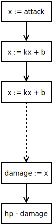

伤害公式与伤害流模型
=============

公式的来源与意义
----------

在游戏中，战斗公式是如此普遍，以致鲜有人再去追问公式的存在意义。

试着回顾下那些古老的游戏，原来是没有公式的概念。譬如超级玛丽吧，主角或怪物碰着
就挂，那就是简单的 0/1 模型。如果一定要套用现在的观点，那就认识攻击与血量都是
1 吧。然后为了增加变化，有些怪物不只要打一下，主角也有可能涨生命多被打几下。也
就是生命属性开始大于 1 了，但攻击属性仍是 1。

如果也把攻击属性提高，会不会再增加游戏的变化呢？其实并不会！如果只有生命与攻击
两个属性，同时加大它们的表现“数字”并无实质意义，真正影响节奏体验的只是血攻比，
也就只有这一个“数值”。所以，为也进一步增加游戏的变化，就引入了防御这个属性。

而所谓战斗公式，也就是由于防御属性的掺和，才使之有讨论或争论的必要。

然而究其本质，战斗公式无非是一种计算伤害的方法。游戏中需要有一方法造成伤害，使
一方的血量降为零，使战斗结束使游戏能结束。所以，我更想称之为伤害公式。

再从公式的起源与现状看，目前主流讨论所谓公式，其实是在定义防御属性对伤害的影响
，因而从这层意义上讲，现在所谓的伤害公式更像是具化的防御公式。


减法与乘法
----------

显然，在没有防御的情况下，伤害就是攻击。

减法公式的表达式是：伤害 = 攻击 - 防御，或用符号表示为 `dh = a - d`。
防御的意义是减少伤害的绝对值。

乘法公式的表达式是：伤害 = 攻击 * 常数 / (防御 + 常数)，看起来有点复杂，其实它
是从免伤率推导而来的。免伤 = 防御 / (防御 + 常数)，伤害 = 攻击 * (1 - 免伤)。

```
r = \frac{d}{d+c}  \\
dh = a (1-r) = \frac{ac}{d+c}
```

所以防御的意义是减少伤害的相对值。

对减法与乘法（防御）公式的比较、争论，由来已久，就犹如程序猿聚在一起就有可能争
辩什么是最好的编程语言一样。这两种公式带来的不同体验，简单地说，就是减法爽，乘
法稳。

再看下乘法公式，它似乎凭空多冒出个“常数”来，这个常数又是什么鬼呢。可以理解为它
是防御属性的标杆、参照物。当防御正好等于这个常数时，免伤一半，此后继续增加防御
，它所带来的免伤是递减的，且以 1 为极限。仅管免伤是曲线衰减的，但防御实际带来
的有效生命价值是线性的：`EHP = h * (1 + d/c)`。其意义是，每增加 1 点防御，就相
当于增加 `1/c` 倍生命上限，或者说能多承受 `1/c` 次伤害打击。

思考个问题。如果是想把防御做成减少伤害相对值的话，直接把减伤定义为 `r = d/c`　
是否合适呢？如此，`dh = a * (1-r) = a - d*a/c`。那其实是更像减少公式了，不过增
加了个调节参数而已。

有的文献还提到一种除法公式。除法与乘法本质是一样的。上面乘法公式中，不是有个控
制参数 c 吗？如果令 `c = a`，就变成如下形式：

```
r = \frac{d}{a+d}  \\
dh = a (1-r) = \frac{a^2}{a+d}
```

也就是传说中的“除法公式”：伤害 = 攻击平方 / (防御 + 攻击)。

这个除法公式与乘法公式的不同，就在于取消了防御参数 c，而直接让防御属性参考攻击
者的攻击属性，使攻击属性控制防御向免伤率的转化。

除法公式精简了那个凭空多出来的常数 c，使伤害公式在数学形式上似乎更优美些。不过
除法公式对游戏体验的影响是，它显然放大了攻击的价值。本来攻击与血量是互为对抗的
一对属性，我们常说用血攻比来控制战斗节奏就是这个意思。只是后来多了防御这个小三
，才使得战斗公式变量有争议起来。

乘法公式之所以说它平稳，就在于有个常数 c 来约束防御属性，与防御互为对抗的属性
其实不是攻击，而这是这个对所有角色（同等级）都一样的常数。如果让防御也去勾搭攻
击属性，那就是除法公式了。

也许设个不动如山常数，就像个波澜不惊、木有情趣的老管家。但若像除法公式那样让攻
击属性一兼二职，又太过粗暴了。所以这有个思路，让常数 c 也化身一个基本属性，比
如说叫“破防”，与防御一样是玩家可见可控可培养的属性，让防御与破防一起计算个免伤
率。公式形式与乘法公式完全一致，只是 c 不再是常数，而是可以成长的破防属性——或
者，可以根据游戏项目的背景包装个更拉风的名字。


随机事件概率
----------

随着游戏复杂度的需求进化，只增加防御还不够（题外话，再加上上述的破防呢），于是
又增加了许多随机属性来丰富玩法，如暴击、格挡、闪避等。

在追求堆属性、卖属性的游戏中（比如绝大多国产网游），一般还不直接投放暴击率，而
是投入暴击值与抗暴值，让玩家互为对抗，通过双方的暴击与抗暴来计算个暴击率。

参考乘法公式中对免伤率的分数式定义，正如它允许对防御属性的无限追求而不溢出，暴
击率及其他率公式也可类似定义：暴击率 = 暴击 / (暴击 + 抗暴)。

```
r = \frac{x}{x + x}   \\
r = m \frac{x}{x + n x'}
```

假设 x 与 x’ 是互为对抗的两个属性，那么用 x/(x + x’) 计算某种概率就相当平稳了。
其实上文所述的防御破防（d 与 c）也可类似理解。

不过更通用的公式写法是再加个修正吧，`r = m * x/(x + n*x’)`。其中 m 表示概率或
比率的极限，如果想控制极限为不为 1 的其他值，就增加这个系数吧。分母下的 n 则用
于控制属性与抗的相对值大小，如果想让属性与抗性的价值（数字大小的价值）不一样，
就调节这个参数吧。


伤害流模型
---------

在实际的游戏项目中，除了上述的基本属性与随机事件属性，影响最终伤害的因素还有很
多很多，比如技能、buff、各种伤害加深、伤害减免等。在这种情况下，单纯地讨论伤害
公式是没有意义的——防御公式本来就是理论意义大于实践——若从游戏的最终程序实现角度
来讲，把伤害公式扩展为一种伤害算法更具普遍意义。

所谓伤害算法，就是如何综合考虑游戏内设定的所有可能影响伤害的属性因素，以一种确
定的流程在给定状态下计算出具体的伤害值，并使目标生命减少的算法。总结目前常规游
戏的做法，这里提出一个串并联伤害流线性响应的模型，用以表达通用的伤害算法。

正因为影响伤害的因素越来越多，越来越复杂（至于为什么要这样，问系统策划去），为
了理清伤害计算的过程，我们把瞬时产生的伤害放慢镜头来入微观察。把伤害想象为一种
伤害流，或能量波，它从攻击者身上发起，经过传递，最终达到被击者身上，造成伤害。

在伤害流的传递过程中，途经的各类系统因素不断修正伤害值的大小，总得来说，在攻击
者这方，可能会有很多放大伤害的因素，比如技能、暴击及其他伤害加深buff；待传递到
被击方，又会很多减小伤害的因素，比如防御、格挡及其他伤害减免buff。其实还可以在
中间插入更多的花样，比如战场环境，可以对某种属性的伤害加成，又比如（回合制）的
阵型，也能提供什么伤害加成……

把所有这些影响伤害的因素按一定的顺序串起来，形成一个畅通的管道，伤害流每经一个
接口，都进行线性缩放。通用公式就是 `x = k*x + b`，即每个接口使伤害流变成原来的
k 倍，再额外增加 b 点伤害。

系数 k 与 b 不一定在每个接口都存在。如果 b=0 ，只有 k ，那就是影响相对伤害；如
果 k=1，只有 b，那就是影响绝对伤害；如果 k=1 且 b=0，那就是对伤害没有任何影响
。k>1 或 b>0，表示伤害加深，k<1 或 b<0，表示伤害减免。



那么，随机事件怎么办，比如暴击？所谓随机，是指多次重复事件的统计而已，对于具体
某次伤害来说，要么不暴击，要么暴击了。如果没暴击，那就是 k=1, b=0 对伤害没影响
；如果触发暴击，按 2 倍暴击伤害论，就是 b=2, b=0。

有些游戏不止一种伤害类型，最常见的就是物理与魔法伤害（比较疯狂的还有各种元素伤
害）。有些角色只造成物理伤害，另些角色只造成魔法伤害，还有些变态的人或技能则造
成物魔混合伤害。在这种情况下，只需把物理伤害流与魔法伤害分开计算，把它们视为“
并联”的，并行不悖，泾渭分明，那就可以了。仅管有些接口因素影响作用相似，比如都
是 2 倍暴击伤害，但仍视为两种不同的接口，毕竟物理伤害暴击后不会变成魔法伤害，
魔法伤害暴击后也不会变成物理伤害。

这个基于伤害流的串并联线性响应模型，听起来复杂，其实结构清晰，实现简单，也就只
有传说中的加减乘除而已。虽不致说包罗万象，却也覆盖面极广，且扩展也容易。如果后
面增加了新玩法会影响战斗伤害，只要在原来的伤害流管道中合适的地方增加一个接口，
多执行一步 `k*x +b` 的线性计算即可。游戏设计者需要斟酌的是，合理安排各因素接口
的计算顺序，使其更符合游戏背景世界的设定，当然了，计算顺序也会对属性价值产生不
同影响。如果后期新增系统，对伤害公式修正都只简单地在后面乘系数，不觉得是很 low
且可能很混乱的做法么？


模型实现参考脚本
-------------

- 减法公式：equsubtract.m
- 乘法公式：equmultiply.m
- 除法公式：equdivide.m
- 比率公式：fracrate.m
- 伤害流模型：dgflow.m
